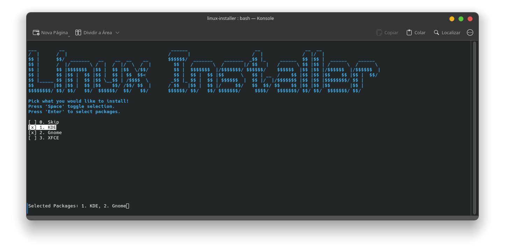

# Linux Installer

This project provides a modular and extensible Linux installation toolkit, including shell scripts and Python utilities for automating software setup and system configuration.



## Folder Structure

- scripts/main/ : Contains the main Python modules and utilities for the installer:

  - `ascii_art.py`: ASCII art utilities for terminal output.
  - `installer.py`: Core installation logic and workflow.
  - `main.py`: Entry point for the installer.
  - `packages.py`: Package management and installation routines.
  - `screen.py`: Terminal screen and selection utilities.

- scripts/custom/ : Custom shell scripts for installing and configuring specific applications:

  - `docker.sh`: Docker installation and setup.
  - `veracrypt.sh`: VeraCrypt installation and setup.
  - `vscodium.sh`: VSCodium installation and setup.

- `init.sh` : Main shell script to initialize the installer, detect the Linux distribution, and launch the Python installer.

## Usage

1. Run `init.sh` from the project root to start the installer:

```bash
./init.sh
```

2. The script will detect your Linux distribution and launch the Python-based installer.

3. Follow the on-screen instructions to select and install desired packages and tools.

4. Once completed, you can check installation logs at `logs/`.

## Requirements

- Bash shell
- Python 3
- Supported Linux distribution (uses os-release for detection)